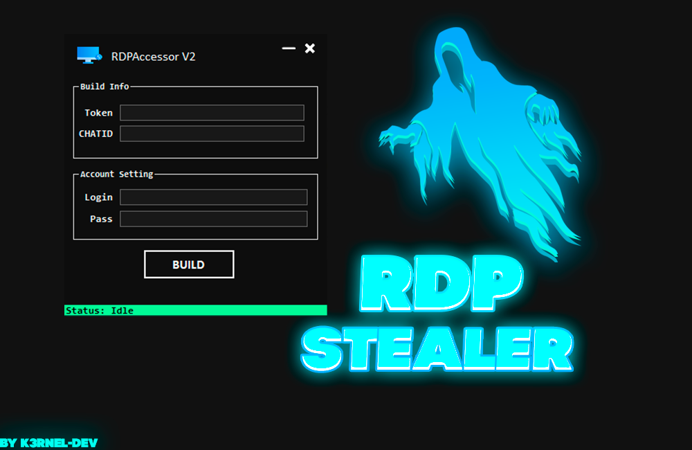
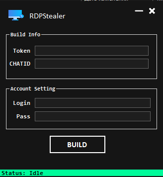
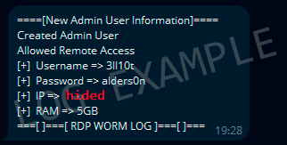

# RDPStealer

## 📑 About
</b>RDPStealer(RDPAccessor) creating a hidden user with sending to telegram</b>
<strong>Most simple rdp stealer(accessor), this program have builder for crafting stubs.</strong>

### 💾 Features:
 * Changelog: 10/02/2024
 * Build Size: 6kb✅
 * Self-Delete after send in telegram-bot:✅
 * Protections of debuggers/monitors/and etc:✅

## 💻 Screens

  
  

 

## How to use?
 * Create bot in telegram: @BotFather and get your chatid with bot @getmyid_bot
 * Put this data in software and enter your desired login password to access rdp-server
 * Final: tap to build and enter path to save exe

 ### 🕸️ Notation (if ):
 > If you decide to rewrite this project, you will need Ilasm for compilation, keep this in mind.
 > The project releases already have a ready-made version for work.

 ### 🃏Updates-Note:
 * //TODO add. . .

## ⚠️ Disclaimer - this project for education and purposes only!

## ✨ End
<strong>Thanks for watching</strong>
